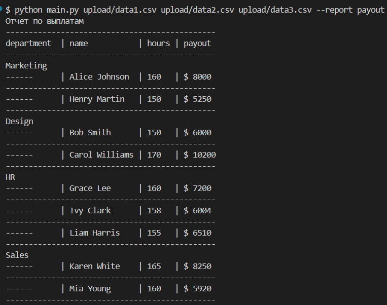

# employees-reporter
Консольное приложение для генерации отчетов из данных файлов

## Установка
``` bash
# Клонировать репозиторий:
git clone https://github.com/Wiltort/employees-reporter.git
cd employees-reporter

# Установить зависимости:
python -m venv venv
source venv/bin/activate  # Linux/MacOS
venv\Scripts\activate  # Windows
pip install -r requirements.txt
```

🚀 Использование
Базовый синтаксис:
``` bash
python main.py [ФАЙЛЫ] --report [ТИП_ОТЧЕТА]
```
Пример:
``` bash
python main.py upload/data1.csv upload/data2.csv --report payout
```

### Параметры
- ФАЙЛЫ - Пути к входным файлам
- ТИП_ОТЧЕТА - Тип генерируемого отчета
### Поддерживаемые форматы
- Входные данные: CSV (по умолчанию)
- Выходные отчеты:
    - Консольная таблица
    - JSON-файл (сохраняется в reports/data.json)
### Обработка ошибок
Коды возврата:

- 0 - успешное выполнение
- 1 - ошибка ввода (неверные аргументы)
- 2 - внутренняя ошибка приложения
```bash
# Примеры ошибок:

# Не указаны файлы
Ошибка: Не указан ни один файл

# Неверный тип отчета
Ошибка: Неверный тип отчета
```

# Структура проекта
```
.
├── reports/             # Содержит json отчет
├── src/                 # Исходный код
│   ├── reports/         # Классы отчетов (Новые отчеты добавлять тут)
│   ├── utils/           # Функция для сбора наследников
│   ├── cli.py           # Парсер аргументов
│   ├── data_processing.py # Содержит классы для работы с данными
│   ├── file_import.py   # Импортер файлов (легко расширяем на другие типы)
│   ├── report_processing.py # Логика отчетов
│   └── views.py         # Вьюхи для табличного вывода в консоль
├── tests/               # Юнит-тесты
├── upload/              # Папка для файлов с данными
├── config.py            # Файл настроек
├── main.py              # Точка входа
└── requirements.txt     # Зависимости
```